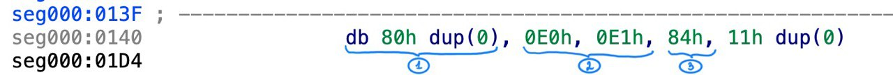
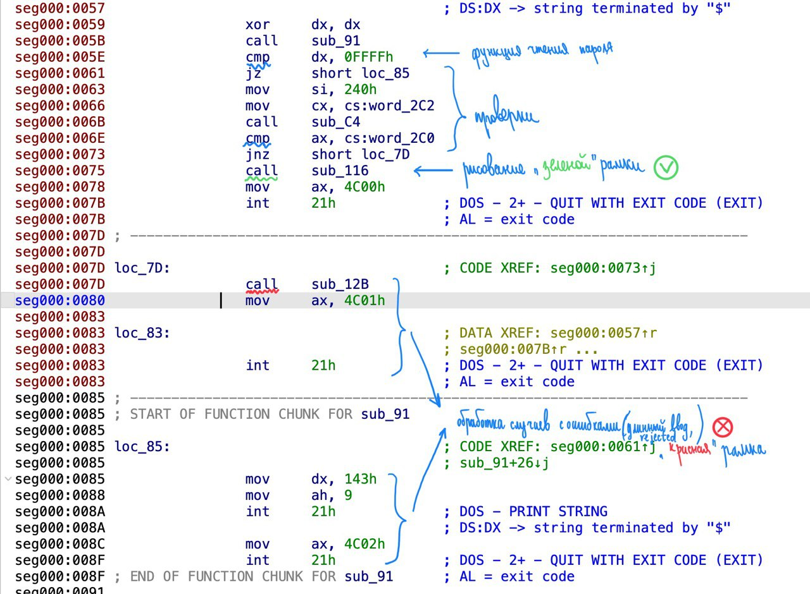
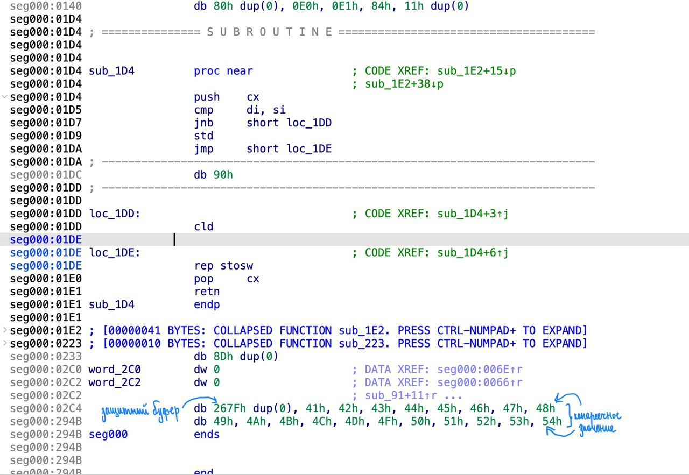
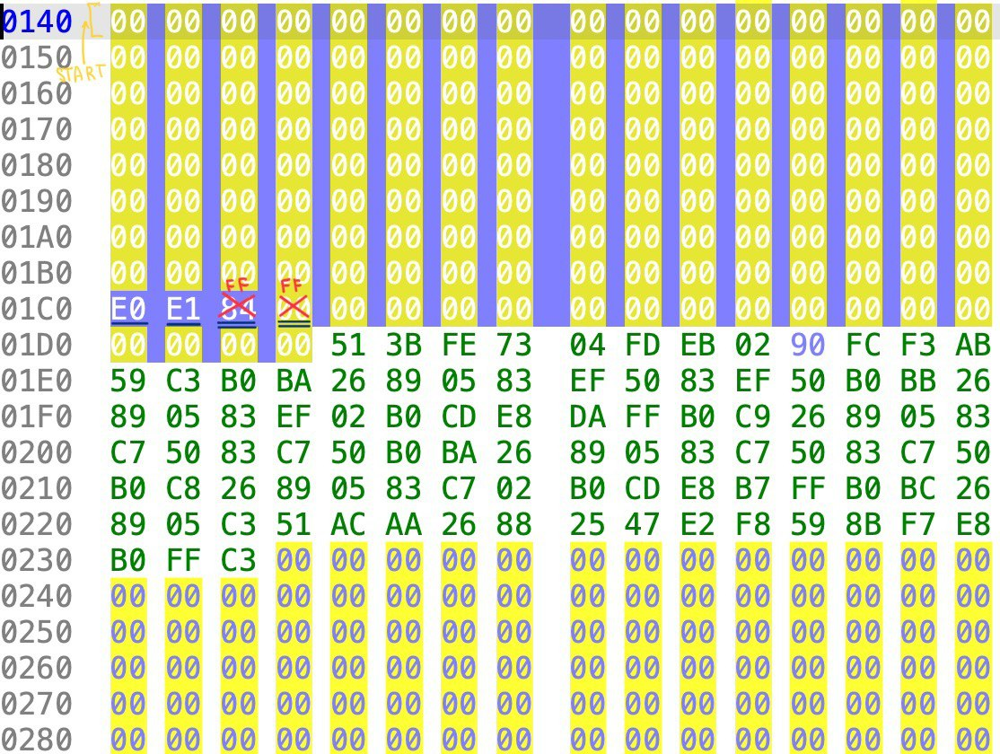
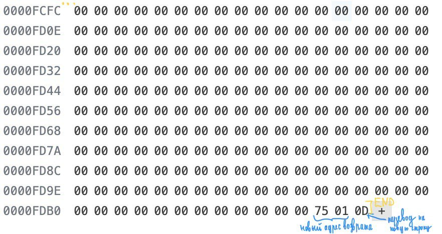

# Взлом пароля

Нашей целью было:

1. Написать программу, проверяющую на правильность введённый пароль, заложив в неё 2 уязвимости;
2. Обменяться `COM` файлами и попытаться пройти проверку пароля от напарника без знания правильного пароля.

---

## Описание уязвимостей в программе, написанной мной

1. Метки расставлены так, что переполнением буфера можно затереть метку `rejected`, чтобы переходить всегда на метку `approved`.

2. В стековой реализации из-за недостаточной проверки на длину введённого буфера можно сначала переписать лимит буфера, затем канарейки и с лёгкостью поменять адрес возврата функции (сначала проставляем 25 значений буфера, потом меняем канарейку и лимит размера, а затем адрес возврата).

---

## Описание уязвимостей в программе, написанной напарником

### Уязвимость 1 — переполнение глобального буфера

Сначала было замечено, что буфер для введённого пароля и эталонный хэш лежат в памяти рядом, следовательно при переполнении буфера можно переписать этот самый хэш на любой нужный.

    

- **(1)** — это буфер, в который записывается введённый мной пароль;
- **(2)** — эталонный хэш;
- **(3)** - максимальный разрешенный лимит символов на пароль.

Поэтому нужно было просто перезаписать 128 значений и переписать новый хэш для этих символов.

### Уязвимость 2 — перезапись адреса возврата

Затем мной была подробно рассмотрена структура программы, а именно проверка пароля на правильность. 

Было принято решение поменять адрес возврата с функции чтения пароля сразу на печать «зелёной» рамки.

    

Для этого снова нужно было использовать переполнение буфера.

Сначала я скопировала все байты программы из исходного файла, начиная с `0x140` (именно этот адрес указывает на начало буфера), заканчивая `0xFFFC`.

А затем в нужных ячейках перезаписала лимит буфера, находящийся прямо за эталонным хэшем, и адрес возврата.

---

Код, который пришлось перекопировать (отвечает за рисование рамки)

    

---

### Байты, которые были перекопированы

  
  

